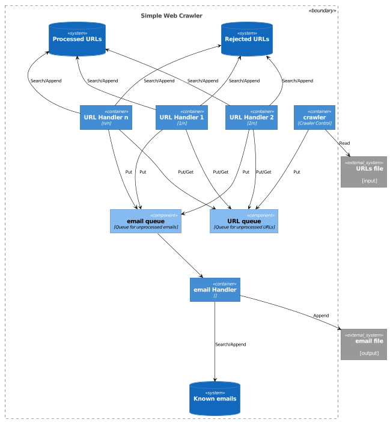
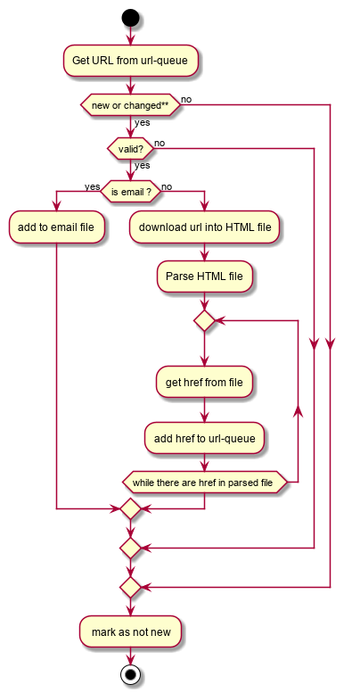
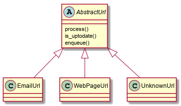
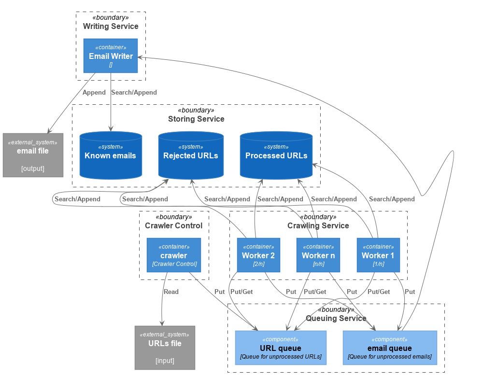

# Simple Web Crawler

## Overview

A simple web crawler that given a list of URLs it will recursively fetch resources and extract from them all <B>referred</B> emails.
## Files and folders:

- `crawler.py`: System's main, responsible for handling command line parameters, reading input file, creating shared 
    structures and firing threads.
- `worker.py`: Code for the "worker" threads, i.e., the threads doing the heavy lifting of the crawling process:
   fetch, parse and search
- `writer.py`: Code for the thread responsible for writing the list of emails found to the output file
- `urls.py`: Classes for URL objects. To simplify the code of the workers, each category of URLs (email, webpage, unknow) gets a dedicated class 
   for handling the corresponding URLs.
- `Dockerfile`: Use to build the crawler container
- `build/requirements.txt`: Python dependencies. Used by Dockerfile to build container
- `tests`: Simple HTML files and docker compose files to create docker swarm stacks with nginx serving the HTML files. 
   See [Testing](#testing) section) for details on how to use these. 
- `design`: PlantUML files (text-based tool for "drawing" UML diagrams) and corresponding diagrams explaining the 
   system's design. These diagrams are included in this document (with explanations) in the [Design](#design) section.
- `runs`: Folder used to collect input, output and log files from different runs of the system. The comments in the
   [Observations](observations) section refers to these files.
## Building:

### Option 1: Use docker 

To simplify dependency management a Dockerfile is provided with the code such that a self contained docker image can be 
easily build as follow:

`docker build -t crawler .`
 
### Option 2: Python application 

For the application to run as a python script there is a need to install the BeautifulSoup4 library as follow:

`sudo pip3 install bs4`
 
## Running:

### Option 1: Use docker 

`docker run -d -v $(pwd):/<guestdir> crawler [-f <filename> | -u <url>] -o /<guestdir>/<outputfile>`
 
 Please note that it is important to pass the volume parameter (`-v <hostdir>:<guestdir>), without it the resulting output
 file (and logs) will only be available in the container's file system
  
 For a list of all supported flags type:

`docker run -ti crawler -h`
 
### Option 2: Python application 

`python3 crawler.py  [-f <filename> | -u <url>] -o <outputfile>`

For a list of all supported flags type:

`python crawler.py -h`

### Supported flags (applicable to both options above):

- `-i <filename>, --input <filename>`:
- `-u <URL>, --url <URL>`:
- `-o <filename>, --output <filename>`:
- `-n #, --nthreads #`: [Optional] Number of threads. Default: 10
- `--maxdepth`: [Optional] Maximum depth to crawl. Default: no limit
- `--verbose` : [Optional] Maximize logs generated (show all logs)
- `--quiet` : [Optional] Minimize logs generated (only critical errors)
- `--logfile <filename>`: [Optional] If present logs are saved to <filename>, otherwise to stout/stderr.
- `-h`: Shows short help message


## Testing

To validate correctness we need to run the system on set of web pages such that the expected results are known. To this
end, a couple of docker swarm stacks are provided. With these stacks, we can easily bring up a set of local web servers with
controlled content.

To deploy the stacks, docker swarm needs to be enabled as follow:

`docker swarm init`

then, the testing web servers can be deployed with the `docker stack deploy -c <stack.yml> command.

### Circular test

The stack in `tests\circular.yml` enables us to test 1. that the system will not enter into an infinite loop, and 2.
only unique emails are saved. It consists of 3 web servers, each with a simple HTML page that point to the next server; 
the HTML in the last server points back to the first one, thus creating a loop. In addition, in the HTML of each server
there is a list of email references, but only one is unique.

To deploy the stack, type (while in the crawler directory):

`TESTS_DIR=$(pwd)/tests docker stack deploy -c tests/circular.yml c`

the run the crawler container as follow:

`docker run --network c_test -v $(pwd)/runs:/tmp crawler -u http://c1 --verbose -o /tmp/circular.out --logfile /tmp/circular.log`

For this to work properly, the network parameter (`--network c_test`) is a must. It connects the crawler to the `c_test`
virtual network and the associated namespace (swarm internal DNS server resolved the hostname `c1` if accessed in the `c_test` 
network)

This should produce the following list of emails:

```
mailto:1@c1.com
mailto:2@c2.com
mailto:3@c3.com
```

### Multi-page test

For multi-page web sites, links to "local" (within the same web server) do not include all the information to be
accessible from the outside. In order to deal with "local" pages, the categorization process (more on this in the
 [Design](design) section) tries to build a fully qualified URL from the information available (the link (current URL) 
 and the referring page (the previous URLs). The stack in `tests/multipage.yml` enables us to test the handling of 
 local pages.

To deploy the stack, type (while in the crawler directory):

`TESTS_DIR=$(pwd)/tests docker stack deploy -c tests/multipage.yml m`

the run the crawler container as follow:

`docker run -d --network m_test -v $(pwd)/runs:/tmp crawler -u http://m1 -o /tmp/multipage.txt --logfile /tmp/multipage.log --verbose`

Again, the network parameter (`--network m_test`) is a must. 

This should producer the following list of emails:

```
mailto:root@mpage.com
mailto:absolute.page@mpage.com
mailto:relative.page@mpage.com
mailto:twolevels.page@mpage.com
```

## Design

### Assumptions
- In memory solution to show functionality. Should be easy to modify to a more resilient solution that uses an
  external data store
- Initial solution may not be fully optimized for performance, but design should consider performance 
  optimizations and implementation easily modified 
- Retrieve emails only in the form of <a href='mailto:...>, while emails may appear anywhere in the text, any modern web 
  authoring tool will automatically add a link to wherever an email address is inserted, so limiting 
  the search to links will most likely find the majority of emails while greatly reducing the parsing complexity.
- Static content (more on this later)

### Solution Components

For best performance the system should be build as a producer-consumer system with queues between: Producers 
find URLs, add them to a queue; and, in parallel, consumers retrieve URLs from the queue, validate them, fetch the 
resource they point to, and then parse the resource (file) and looks for email references, which if found are push to yet
another queue, where a special purpose consumer reads them and writes them to a file. With this general model in mind the 
following components are needed:

1. A queue for URLs
2. A queue for emails
3. The `crawler controller` which is responsible for firing the other components, reading the input file with initial URLs 
and feeding them to the URLs queue, i.e., the `crawler controller` is a producer of URLs
4. A set of one or more `workers` which are responsible for the heavy lifting: get URLs from the queue, validate them, fetch
the resource, parse it, and find in it all the links. For each link found, if it is an email feed it to the emails queue, 
if not feed it to the URLs queue, i.e., the `workers` are both producers and consumers of URLs
5. To avoid processing the same resources more than once we need a set of key-value-stores, where the resources that have
been handled can be stored.
6. A `writer` which is responsible for getting emails from the emails queue and writing them to a file. This job has a
dedicated component, instead of being done by the `workers`, to avoid multiple writers to a single file and the complexity 
of synchronizing them.

The components, as well as their relationships (operations) are shown in the following figure:



Initially, the system is implemented as a multi-threaded python application, with python queues and python dictionaries 
as the key-value-stores.

### Worker flow

As mentioned above, most of the logic falls within the `workers`. The straightforward flow of a `worker` is show in the 
following flowchart:



Clearly, a direct implementation of such workflow will lead to cumbersome, and not easily extensible code. But a close 
look into the first steps after getting an URL from the queue are basically a validation and classification process. With
this insight we can simplify the `workers` flow as follow:


With this approach, the `workers` invoke methods of an `AbstractUrl` class, whereas the classification stage returns a 
instance of one the the URL concrete classes available, and the functionality specific to each URL type is implemented in
the concrete classes. The class diagram for this is shown in the following figure:



With this approach, not only does the `worker` code becomes cleaner, but it not very easy to extend system 
to additional URL types by adding a new concrete derive class.

Special attention is needed on the test of whether a valid, non email, URL is new or updated. For emails a simple
hash of the actual email is enough to ensure uniqueness, but with web pages the name is not enough because the
same URL changes over time, take for example a news web site in which the content constantly changes but the
name stays the same. To deal with these "dynamic" pages we need a more sophisticated implementation of the `is_uptodate`
method of the `WebPageUrl` class. For the initial implementation we assume static web pages, in which case, checking 
whether we already have seen the name (as in emails is enough. A better approach needs a mechanism to invalidate, after
a certain period, entries in the `WebPageUrl` key value store.
 
### Proposed improvements

The single process, all in-memory, python implementation is good as a proof of concept, it not well suited for a 
production system. However, with minor changes to the code and the deployment model, with the same basic design we 
achieve a much robust, scalable and better performing system.

#### Suggested changes (system-wide):
1. Use standalone processes instead of python Threads. Each such process can be packaged as a container
2. Replace python queues with a standalone distributed queuing system, such as `RabbitMQ` or `Kafka`,
3. Replace python dictionaries with a standalone key-value-store system, such as `Redis` or `Memcached`

With these changes in place the system is now made of several service layers (see modified object diagram below), where 
each service can be deployed, scaled and managed independently. For maximum performance, scalability
and availability, this improved system can be easily deployed on a large cluster managed by a 
container orchestration system such as `kubernetes`.    



#### Additional improvements (local):
1. Consider better performing alternatives to `BeautifulSoup` as the parser
2. Download/fetch only parseable resources (i.e, text based files such as HTML, XML)
3. Add support for dynamic content
4. Replace (or add to) the maximum depth with a timeout based mechanism so the system stops when 
it not learning any new URLs

## Known issues
- Unneeded fetching of non-parseable files (images, movies and such)
- Not all "local" urls seems to be properly handled (see `'Unable to categorize'` messages in logs)
- BeatifulSoup seems to have problem parsing non english text (see `' ... confidence ...'` and 
  `'... not decoded ... '` messages in logs)
- Add monitoring thread that periodically prints status (queue sizes and such)
- Limit queue size and add waiting when queue is full ?
- ~~Depth limiting mechanism only works with `nthreads == 1`. Need an alternative mechanism to force workers to stop.~~ 
Maybe levearge the timeout capability of python queues?

## Observations 

From looking at the results after running the system a few times we can get a feeling of what needs further work.
If we look at the numbers:

```shell script
[1]$ grep working *.log | wc -l
97742
[2]$ wc -l *.out
164 total
[3]$ grep fetch *.log | wc -l
4277
[4]$ grep parse *.log | wc -l
3009
[5]$ grep categorize *.log | wc -l
8198
```

From these numbers, we can reach the following conclusions:

1. The use of the `mailto` reference tag is not too common (164 out of almost 10K). Need to revisit the assumption that 
the `mailto` tag will get most of the email addresses

2. Error rate is too high - around 15% (8198+3009+4277). From these errors, 3% will go away if code fetch only
 parseable resources; 4% are probably due to network errors or stale URLs; the remaining 8% is what I labeled as 
 'categorize error' which points to "local references" where the means the URL was not fully qualified and I try to
  build a fully qualified URL from the  at hand (the previous URL). This code needs to be revised to see if we can get 
  better results (less categorize errors).

Another interesting observation is that one of the runs worked on considerable less URLs that the other but both run about the same time (around 1 hour)
and with the same resources (the default 10 threads):

```shell script
[6]$ grep working list1.log | wc -l
55585
[7]$ grep working list2.log | wc -l
4130
```

By looking at the logs of the "lazy" run we can see that the system is waiting on the download of un-parseable large files (
(linux distributions in this case). Code to avoid this will greatly improve performance:

```shell script
[8]$ grep working list2.log | tail
DEBUG: W#00009 working on [http://www.kick.co.il]
DEBUG: W#00009 working on [https://www.vesty.co.il]
DEBUG: W#00009 working on [https://download.mozilla.org/?product=firefox-stub&os=win64&lang=en-US]
DEBUG: W#00005 working on [https://download.mozilla.org/?product=firefox-msi-latest-ssl&os=win64&lang=en-US]
DEBUG: W#00009 working on [https://download.mozilla.org/?product=firefox-stub&os=win&lang=en-US]
DEBUG: W#00009 working on [https://download.mozilla.org/?product=firefox-msi-latest-ssl&os=win&lang=en-US]
DEBUG: W#00009 working on [https://download.mozilla.org/?product=firefox-latest-ssl&os=osx&lang=en-US]
DEBUG: W#00005 working on [https://download.mozilla.org/?product=firefox-latest-ssl&os=linux64&lang=en-US]
```
