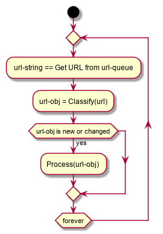

# Simple Web Crawler

#### Overview

A simple web crawler that given a list of URLs it will recursively get and save in a file all refered emails
This is an implementation of 

#### Folders ...:

#### Building:

###### Option 1: Use docker 

To simplify dependency management a Dockerfile is provided with the code such that a self contained docker image can be easily build as follow:

`docker build -t crawler .`

The system was buit and tested with docker version 18.09.7 but given the simplicity of the Dockerfile it may work with older versions as well.
 
###### Option 2: Python application 

As a python application per-se, there is no "build", however for the application to run there is a need to install additional libraries as follow:

`sudo pip3 install bs4`

Which will install the BeatifulSoup version 4 library needed to extract links from HTML files. 
 
#### Running:

###### Option 1: Use docker 

`docker run -ti crawler -f <filename> [-n <number-of-threads>]`
 
###### Option 2: Python application 

#### Test Suite

`TESTS_DIR=$(pwd) docker stack deploy -c circular.yml c`

#### Design

